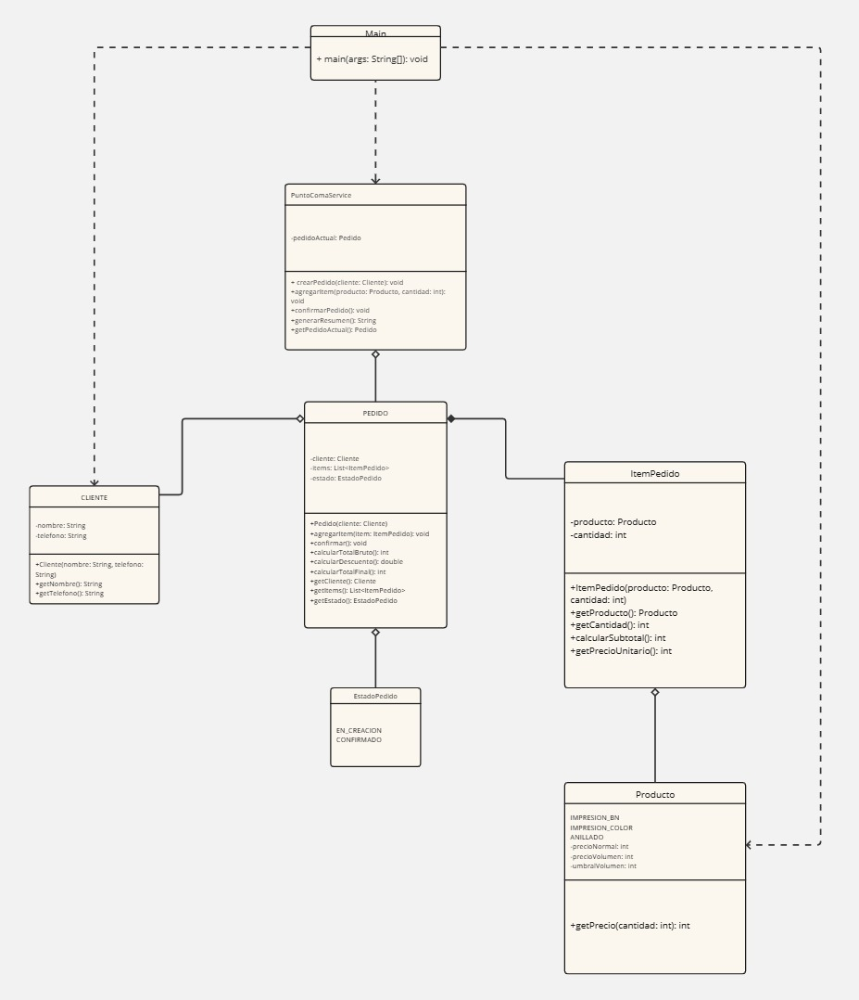
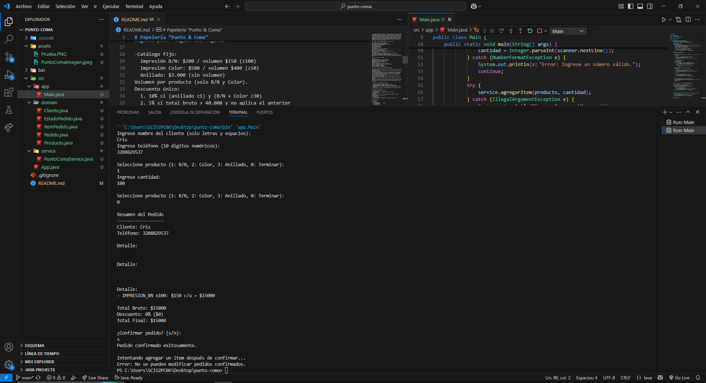
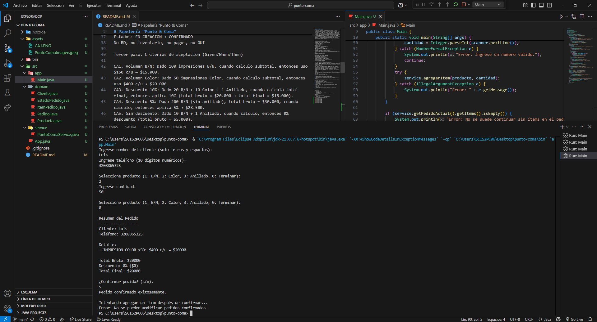

# Papelería “Punto & Coma”

En Punto & Coma, estudiantes e independientes hacen encargos de impresión y anillado para recoger el mismo día. El sistema registra nombre y teléfono del cliente y permite crear un pedido con ítems de este catálogo: Impresión B/N ($200 c/u, o $150 c/u si son 100 o más), Impresión Color ($500 c/u, o $400 c/u si son 50 o más), y Anillado ($3.000 c/u, sin precio por volumen). El cálculo funciona así: primero determinar subtotales por ítem aplicando precio por volumen cuando corresponda; luego sumar el total bruto; después aplicar un solo beneficio: si el pedido incluye al menos un anillado y la suma de impresiones (B/N + Color) es ≥ 30, se aplica 10% de descuento; de lo contrario, si el total bruto > $40.000, aplicar 5% de descuento; si ninguna condición se cumple, no hay descuento. No se aceptan cantidades ≤ 0. Tras confirmar el pedido, queda bloqueado y el sistema debe mostrar un resumen con detalle (precio aplicado por ítem), total bruto, descuento y total final. No se gestiona inventario ni pagos: solo el flujo de crear → calcular → confirmar → resumir.

Primer paso: Extraer requerimientos funcionales del relato

RF1. Registrar cliente (nombre, teléfono).  
RF2. Crear pedido en estado EN_CREACION.  
RF3. Agregar ítems al pedido (producto, cantidad).  
RF4. Aplicar precio por volumen:  
  - B/N: ≥100 → $150 c/u  
  - Color: ≥50 → $400 c/u  
  - Anillado: sin volumen.  
RF5.Calcular total:  
  1. Subtotal por ítem (precio × cantidad).  
  2. Total bruto = suma de subtotales.  
  3. Aplicar un solo descuento:  
   a. Si (anillado ≥1) y (impresiones totales ≥30) → 10%  
   b. Else si total bruto > 40.000 → 5%  
   c. Else → 0%  
RF6. Confirmar pedido → estado CONFIRMADO; luego no se puede editar.  
RF7. Validar: cantidades > 0; totales no negativos.  
RF8.Generar resumen: cabecera (cliente), detalle (producto, cantidad, precio unitario aplicado, subtotal), total bruto, descuento (porcentaje y monto), total final.

Segundo paso: Reglas del negocio

-Catálogo fijo:  
  Impresión B/N: $200 / volumen $150 (≥100)  
  Impresión Color: $500 / volumen $400 (≥50)  
  Anillado: $3.000 (sin volumen)  
Volumen por producto (solo B/N y Color).  
Descuento único:  
  1. 10% si (anillado ≥1) y (B/N + Color ≥30)  
  2. 5% si total bruto > 40.000 y no aplica el anterior  
  3. 0% en cualquier otro caso  
Estados: EN_CREACION → CONFIRMADO
No BD, no inventario, no pagos, no GUI

Tercer paso: Criterios de aceptación (Given/When/Then)

CA1. Volumen B/N: Dado 100 impresiones B/N, cuando calculo subtotal, entonces uso $150 c/u → $15.000.  
CA2. Volumen Color: Dado 50 impresiones Color, cuando calculo subtotal, entonces uso $400 c/u → $20.000.  
CA3. Sin descuento: Dado 10 B/N + 1 Anillado, cuando calculo, entonces 0% descuento (total bruto = $5.000).  
CA4. Bloqueo: Dado pedido CONFIRMADO, cuando intento agregar ítem, entonces se rechaza.  
CA5. Validación: Dado cantidad 0 o negativa, cuando agrego ítem, entonces se rechaza.  
CA6. Resumen: Dado pedido válido, cuando pido resumen, entonces muestra: cliente, ítems con precio aplicado, subtotales, total bruto, descuento (0%, 5% o 10%), total final.

Cuarto paso: Límite del diseño ≤ 5 clases

1. Cliente (entidad simple: nombre, teléfono).  
2. Producto (enum con precios normal y volumen + umbral).  
3. ItemPedido(producto + cantidad → calcula subtotal con volumen).  
4. Pedido (compone ítems, estado, calcula total bruto, aplica descuento único, confirma).  
5. PuntoComaService (coordina: crear pedido, agregar ítem, confirmar, resumen).

Quinto paso: Flujo de consola

1. Ingresar cliente (nombre, teléfono).  
2. Crear pedido.  
3. Seleccionar producto y cantidad (repetir hasta terminar).  
4. Mostrar resumen:  
  - Cliente  
  - Detalle: producto, cant., precio unitario (normal/volumen), subtotal  
  - Total bruto  
  - Descuento (0%, 5% o 10% + monto)  
  - Total final  
5. Confirmar pedido.  
6. Intentar editar post-confirmación → debe fallar con mensaje claro.

Estructura modular

/punto-y-coma/
 ├─ domain/
 │   ├─ Cliente.java
 │   ├─ Producto.java         (enum)
 │   ├─ ItemPedido.java
 │   ├─ Pedido.java
 │   └─ EstadoPedido.java     (enum: EN_CREACION, CONFIRMADO)
 ├─ service/
 │   └─ PuntoComaService.java
 └─ app/
     └─ Main.java             (flujo de consola)

